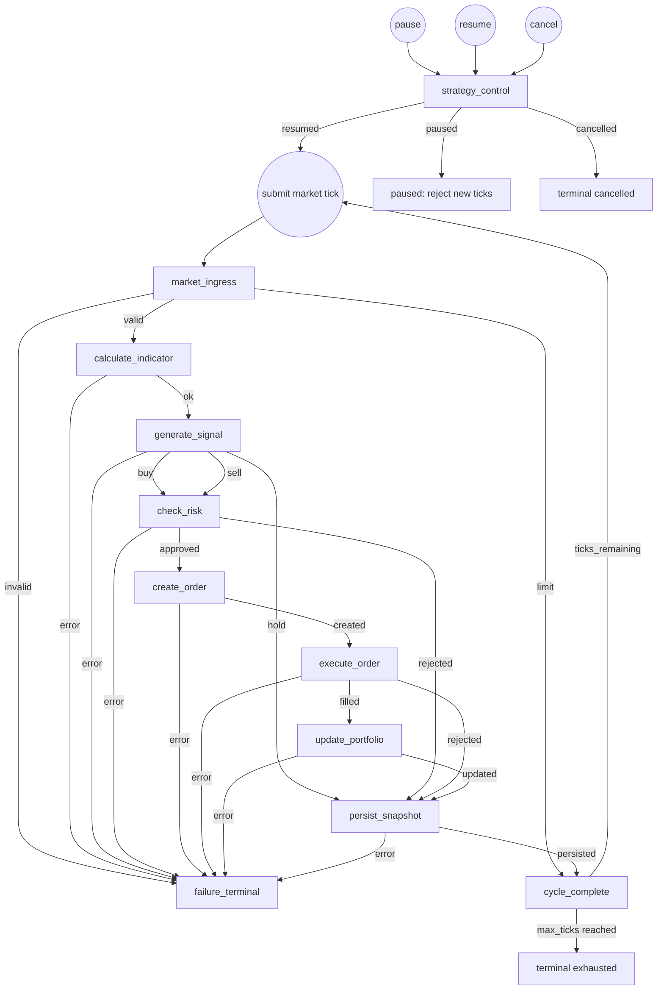

# GraphFlow Quant Trading MVP

## Assumptions and system boundary

This subsystem is a deterministic paper-trading MVP, not a production exchange
gateway. One strategy instance owns one symbol, one `GraphEngine`, one portfolio,
and one moving-average strategy. Instances may run concurrently; ingress for a
single instance is serialized by its workflow mutex.

- Actors: SDK caller, market-data producer, strategy workflow, paper execution
  venue, snapshot store, and event subscriber.
- Public operations: create/destroy an instance, submit a market tick,
  pause/resume/cancel an instance, subscribe to events, and stop the engine.
- Inputs: monotonically increasing timestamped ticks with a positive price and
  quantity, plus JSON configuration. Credentials are deliberately absent.
- Outputs: lifecycle, tick accepted/completed/rejected, signal, risk rejection,
  order, fill, portfolio, cancellation, and failure events.
- Terminal outcomes: cancellation, configured tick-limit exhaustion, fatal
  validation/integration failure, or explicit destruction. A normal tick cycle
  completes without terminating the strategy instance.
- Pause/resume: pausing rejects new tick admission with `Paused`; resuming makes
  the instance admissible again. No in-flight synchronous tick is suspended.
- Cancellation: idempotent at the workflow boundary. It makes the instance
  terminal and every node rejects stale/cancelled generations.
- Concurrency: different instances may be called concurrently. One instance
  processes at most one tick at a time; re-entrant admission returns `Busy`.
- Persistence: an injected `ITradingStore` receives a snapshot after every
  completed/rejected trading decision. The default facade uses an in-memory
  store. Store failure is terminal for that tick and strategy instance.
- External dependencies: `IExecutionVenue` and `ITradingStore` are injected.
  The facade composes a deterministic paper venue; a live broker adapter is out
  of scope.
- Strategy: short/long simple moving-average crossover. Insufficient history is
  `hold`. Position sizing uses a configured fixed order quantity.
- Risk: long-only by default, maximum absolute position, maximum order notional,
  and available-cash checks. Sell quantity is capped by the current position.
- Execution: immediate fill at tick price plus configured slippage in basis
  points; no partial fills, order book, latency model, fees, or corporate actions.

## Layering and ownership

```text
QuantTradingApi::Impl
  -> QuantTradingEngine (instance map, admission, public event projection)
    -> QuantTradingWorkflow (one strategy instance)
      -> QuantRuntimeContext + injected dependencies
      -> graphflow::engine::GraphEngine
        -> JSON-created Quant*Node objects
```

## Business flow



The last loop is bounded by `max_ticks`. It is an ingress lifecycle loop rather
than a graph edge: `market_ingress` remains subscribed while the workflow is
running, and every accepted tick starts one new graph traversal.

## Node contracts

| ID | Class | Responsibility | Inputs | Outputs / conditions | Params | Side effects | Failure route |
|---|---|---|---|---|---|---|---|
| `strategy_control` | `QuantStrategyControlNode` | Apply pause/resume/cancel controls | main-bus control events | public lifecycle event | none | changes admission state | cancellation is terminal |
| `market_ingress` | `QuantMarketIngressNode` | Validate/admit and seed one tick generation | main-bus `MarketTickRequested` | `QuantFlowToken`: `valid`, `invalid`, `limit` | none | appends price, emits accepted | `invalid` |
| `calculate_indicator` | `QuantIndicatorNode` | Calculate short/long SMA | `QuantFlowToken` | `ok`, `error` | none | updates indicators | `error` |
| `generate_signal` | `QuantSignalNode` | Classify crossover decision | `QuantFlowToken` | `buy`, `sell`, `hold`, `error` | `epsilon` | updates signal, emits signal | `error` |
| `check_risk` | `QuantRiskNode` | Enforce position/notional/cash limits | `QuantFlowToken` | `approved`, `rejected`, `error` | none | sets approved quantity/reason | `error` |
| `create_order` | `QuantOrderNode` | Create a deterministic market order | `QuantFlowToken` | `created`, `error` | none | stores order, emits order | `error` |
| `execute_order` | `QuantExecutionNode` | Submit order to injected venue | `QuantFlowToken` | `filled`, `rejected`, `error` | none | external execution, stores fill | `error` |
| `update_portfolio` | `QuantPortfolioNode` | Apply fill to cash/position | `QuantFlowToken` | `updated`, `error` | none | updates portfolio, emits snapshot | `error` |
| `persist_snapshot` | `QuantPersistenceNode` | Persist deterministic cycle snapshot | `QuantFlowToken` | `persisted`, `error` | none | external store write | `error` |
| `cycle_complete` | `QuantCycleCompleteNode` | Publish successful/rejected cycle result and enforce tick bound | `QuantFlowToken` | terminal public event | none | increments completed cycles | none |
| `failure_terminal` | `QuantFailureNode` | Publish terminal failure and close admission | `QuantFlowToken` | terminal public event | none | marks failed | none |

## Remaining production risks

Live trading requires a durable idempotency key, exchange reconciliation,
partial-fill handling, trading calendars, fee/tax models, precision rules,
corporate actions, market-data gap policy, secure credentials, audit logging,
and operational kill switches. Those concerns intentionally remain outside this
paper-trading MVP.
